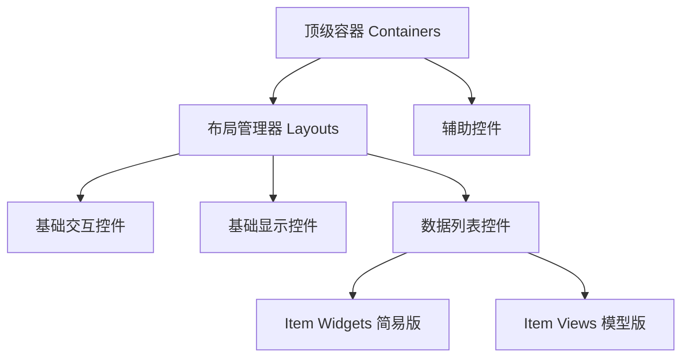

# Qt 控件关系与核心用法 复习手册
**基于个人实战代码整理** | 涵盖容器、布局、模型/视图、交互控件 | 随时复习控件层级与协作逻辑

---

## 一、文档说明
本手册整合你编写过的**时钟、文件浏览器、按键控制、定时器**等实战代码，梳理 Qt 控件的**层级关系、分类、用法、协作逻辑**，解决「控件怎么选、怎么搭配、为什么这么写」的核心问题。

---

## 二、Qt 控件核心层级总览
Qt 控件遵循 **「顶级容器 → 布局管理器 → 子控件」** 的层级结构，数据展示类控件分为**简易控件**和**模型/视图架构控件**两大分支。



**核心规则**：
1. 所有控件必须依附**父容器**存在（自动内存管理）
2. 布局负责自动排版，容器负责承载控件
3. 模型/视图架构：**数据与展示分离**，多视图共享数据

---

## 三、第一部分：骨架控件（容器 + 布局）
### 3.1 容器控件（Containers）
**作用**：承载其他控件，是窗口的「外壳/分组盒子」，自带 UI 样式。

| 控件名 | 核心作用 | 我的实战代码 |
|--------|----------|--------------|
| `QWidget` | Qt 所有控件的基类，基础空白窗口 | 主窗口基类、自定义控件父容器 |
| `QSplitter` | 可拖动分割窗口（水平/垂直） | **文件浏览器**左右分栏 |
| `QTabWidget` | 多标签页容器 | 多页面切换 |

#### 我的代码示例（QSplitter）
```cpp
// 核心：创建分割容器，作为树形视图+列表视图的父对象
QSplitter* splitter = new QSplitter;
// 子控件依附容器，自动加入布局
QTreeView* tree = new QTreeView(splitter);
QListView* list = new QListView(splitter);
```

---

### 3.2 布局控件（Layouts）
**作用**：**看不见的排版规则**，自动管理控件位置、大小、间距，窗口缩放自适应。

| 控件名 | 核心作用 | 适用场景 |
|--------|----------|----------|
| `QHBoxLayout` | 水平布局 | 按钮横向排列 |
| `QVBoxLayout` | 垂直布局 | 时钟、表单纵向排列 |
| `QGridLayout` | 网格布局 | 计算器、表格排版 |

**关键**：布局必须设置给**容器**，子控件添加到布局中。

---

## 四、第二部分：基础交互/显示控件
### 4.1 显示控件（Display Widgets）
**作用**：纯展示数据，无复杂交互，开箱即用。

| 控件名 | 核心作用 | 我的实战代码 |
|--------|----------|--------------|
| `QLCDNumber` | 数码管样式显示数字/文本 | **电子时钟** |
| `QLabel` | 文本/图片展示 | 标题、提示文字 |

#### 我的代码示例（QLCDNumber 时钟）
```cpp
// 定时器每秒更新时间，数码管展示
ui->lcdNumber->setDigitCount(8);
ui->lcdNumber->display("12:34:56");
```

---

### 4.2 交互控件（Input/Buttons）
**作用**：接收用户操作（点击、输入、键盘）。

| 控件名 | 核心作用 | 我的实战代码 |
|--------|----------|--------------|
| `QPushButton` | 普通按钮 | 键盘控制移动的按钮 |
| `QLineEdit` | 单行文本输入 | 用户名/密码输入 |

#### 我的代码示例（按键控制按钮移动）
```cpp
// 键盘方向键控制 QPushButton 移动
QPoint curpos = ui->pushButton->pos();
curpos.setY(curpos.y() - 5);
ui->pushButton->move(curpos);
```

---

## 五、第三部分：数据列表控件（核心重点）
Qt 列表控件分**简易版**和**模型版**，**我的文件浏览器用的是模型版**。

### 5.1 分类对比
| 分类 | 控件 | 特点 | 适用场景 | 我的代码 |
|------|------|------|----------|----------|
| **Item Widgets（简易版）** | `QListWidget`/`QTreeWidget` | 控件自带数据，无需模型 | 简单列表、快速开发 | 简易文件列表 |
| **Item Views（模型版）** | `QListView`/`QTreeView` | 模型/视图分离，多视图共享数据 | 复杂文件系统、高性能 | **文件浏览器** |

---

### 5.2 模型/视图架构核心（我的文件浏览器）
**三剑客**：
1. **模型（Model）**：`QFileSystemModel` → 管理文件系统数据
2. **视图（View）**：`QTreeView` + `QListView` → 展示数据
3. **协作**：**一个模型，两个视图共用**

#### 我的完整代码
```cpp
// 1. 容器：分割窗口
QSplitter* splitter = new QSplitter;

// 2. 数据模型：管理文件系统
QFileSystemModel* model = new QFileSystemModel;
model->setRootPath(QDir::currentPath());

// 3. 两个视图，共用同一个模型
QTreeView* tree = new QTreeView(splitter);  // 树形目录
tree->setModel(model);
tree->setRootIndex(model->index(QDir::currentPath()));

QListView* list = new QListView(splitter);   // 列表文件
list->setModel(model);
list->setRootIndex(model->index(QDir::currentPath()));
```

**核心关系**：
- 模型负责**数据**，视图负责**展示**
- 修改模型 → 所有关联视图**自动同步更新**
- 容器负责承载视图，布局负责排版

---

## 六、第四部分：控件协作实战（我的两个核心项目）
### 6.1 实战1：数码管时钟
**控件组合**：`QWidget`(容器) → `QVBoxLayout`(布局) → `QLCDNumber`(显示) + `QTimer`(逻辑)
```cpp
// 定时器1秒触发一次，更新LCD显示
QTimer* timer = new QTimer(this);
connect(timer, &QTimer::timeout, this, &Widget::slot_update_led);
timer->start(1000);
```

### 6.2 实战2：文件浏览器
**控件组合**：`QSplitter`(容器) → `QTreeView`+`QListView`(视图) → `QFileSystemModel`(数据)
**核心**：模型与视图分离，多视图共享数据。

---

## 七、第五部分：避坑指南（我踩过的坑）
1. **父对象必须设置**
   - `new QTreeView(splitter)` → 依附容器，否则变成独立窗口
   - Qt 父子机制：父销毁，子自动销毁（无内存泄漏）

2. **模型/视图必须绑定**
   - 视图必须调用 `setModel(model)`，否则无数据

3. **布局必须用**
   - 不设置布局 → 窗口缩放控件错位

4. **定时器/事件重写规范**
   - `keyPressEvent` 过滤自动重复：`if(event->isAutoRepeat()) return;`
   - 低级定时器必须保存 ID，析构函数 `killTimer`

---

## 八、第六部分：控件选择速查表
| 需求 | 推荐控件 |
|------|----------|
| 可拖动分栏窗口 | `QSplitter` |
| 数码管时钟 | `QLCDNumber` |
| 简单按钮/点击 | `QPushButton` |
| 简易文件列表 | `QListWidget` |
| 高性能文件浏览器 | `QFileSystemModel + QTreeView + QListView` |
| 自动排版 | `QHBoxLayout/QVBoxLayout` |

---

## 九、总结
1. **层级**：容器 → 布局 → 控件
2. **核心**：模型/视图分离（我的文件浏览器）
3. **内存**：设置父对象，自动管理
4. **用法**：容器装控件，布局管排版，模型管数据，视图管展示
