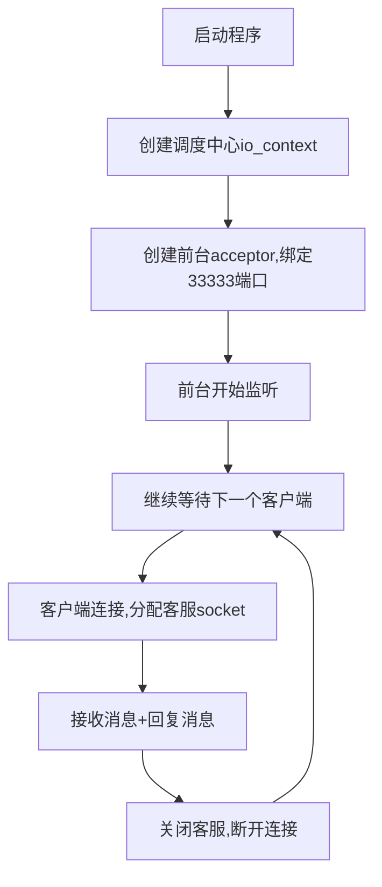

我将**逐行、逐模块、结合你已学的所有知识**，把这份**完整可运行的TCP服务器代码**讲得彻彻底底！
延续之前的**公司/前台/客服**比喻，让你秒懂服务器的工作原理：
- `io_context` = **公司总部（调度中心）**
- `tcp::acceptor` = **前台接待员**（只负责接客户，不聊天）
- `tcp::socket` = **专属客服**（和单个客户一对一聊天、收发数据）
- 端口 `33333` = **公司门牌号**

---

# 一、代码整体功能
这是一个**同步阻塞式 TCP 服务器**，核心能力：
1. 绑定本机 `33333` 端口，持续监听客户端的连接请求
2. 每来一个客户端，就分配一个专属 `socket` 服务
3. 接收客户端发来的消息，回复固定消息
4. 服务完成后断开连接，继续等待下一个客户端

---

# 二、逐模块逐行精讲

## 模块1：头文件 + 命名空间
```cpp
#include <boost/asio.hpp>   // Boost.Asio网络核心库
#include <iostream>         // 输入输出打印
#include <string>           // 字符串处理

using namespace boost::asio;     // 简化Boost.Asio代码
using namespace boost::asio::ip;  // 简化IP/TCP类名
```
- 作用：不用写冗长的 `boost::asio::ip::tcp`，直接写 `tcp` 即可，简化代码。

---

## 模块2：`create_acceptor` 函数（服务器初始化核心）
这个函数的唯一作用：**把前台接待员（acceptor）安排到指定门牌号（端口）上班**
分为 **3个必死步骤**：`打开 → 绑定 → 监听`

### 1. 打开套接字 `open()`
```cpp
acceptor.open(tcp::v4(), ec);
```
- 给前台**开通工作权限**，指定用 `IPv4` 协议
- 失败场景：权限不足、系统资源不足

### 2. 绑定端口 `bind()`
```cpp
tcp::endpoint ep(tcp::v4(), port);
acceptor.bind(ep, ec);
```
- **核心**：告诉操作系统「我要占用 `33333` 端口」
- `tcp::v4()` = 监听本机**所有IP**（局域网/公网/本地回环都能连）
- 失败场景：**端口被其他程序占用**（最常见错误）

### 3. 开始监听 `listen()`
```cpp
acceptor.listen(10, ec);
```
- 前台正式**上班等客户**
- 参数 `10` = 等待队列长度（最多同时排队10个客户端）
- 执行到这里，服务器才算**真正启动**

---

## 模块3：`main` 函数（服务器主流程）
### 步骤1：创建调度中心
```cpp
io_context ioc;
```
- 服务器的**大脑**，管理所有前台、客服的工作
- 生命周期：贯穿整个程序（最先创建，最后销毁）

### 步骤2：创建前台 + 初始化
```cpp
tcp::acceptor acceptor(ioc);
if (create_acceptor(ioc, acceptor, 33333) != 0) {
    return 1;
}
```
- 创建前台接待员，绑定调度中心
- 调用初始化函数，安排到 `33333` 端口上班
- 初始化失败直接退出程序

### 步骤3：死循环等待客户端（核心）
```cpp
while (true) {  // 无限循环：永远等客户
```
- 服务器必须**永久运行**，所以用死循环

### 步骤4：接受客户端连接 `accept()`
```cpp
tcp::socket client_sock(ioc);  // 创建一个空客服
acceptor.accept(client_sock, ec);  // 前台把客户交给客服
```
- ✨ **最关键一行**：
  `accept()` 会**阻塞卡住**，直到有客户端连接
- 连接成功后：`client_sock` 变成和客户端绑定的**专属客服**
- 前台（acceptor）继续等待下一个客户

### 步骤5：打印客户端地址
```cpp
tcp::endpoint client_ep = client_sock.remote_endpoint();
std::cout << "客户端连接成功: " << client_ep.address() << ":" << client_ep.port() << std::endl;
```
- 获取客户端的 IP+端口，方便调试

### 步骤6：收发数据（客服和客户聊天）
```cpp
char buf[1024] = {0};
client_sock.receive(buffer(buf), ec);  // 接收客户端消息
if (!ec) {
    std::cout << "收到客户端消息: " << buf << std::endl;
    std::string reply = "Hello from server!";
    client_sock.send(buffer(reply), ec);  // 回复消息
}
```
- `receive()`：阻塞等待客户端发消息
- `send()`：给客户端回复消息
- 只有**客服（socket）**能收发数据，前台（acceptor）不行

### 步骤7：关闭连接
```cpp
client_sock.close();
std::cout << "客户端断开连接" << std::endl;
```
- 服务完成，客服下班，释放资源
- 循环回到开头，继续等待下一个客户

---

# 三、服务器完整运行流程（可视化）


---

# 四、核心必背知识点（面试/开发必考）
## 1. `acceptor` 和 `socket` 的本质区别
| 对象 | 角色 | 功能 | 数量 |
|------|------|------|------|
| `tcp::acceptor` | 前台 | 监听端口、接受连接 | 整个服务器**只有1个** |
| `tcp::socket` | 客服 | 收发数据、通信 | **1个客户端对应1个** |

## 2. 同步阻塞模式
- `accept()`、`receive()` 都会卡住程序，直到操作完成
- 优点：简单、易理解
- 缺点：同一时间只能服务**1个客户端**（适合学习，高并发用异步）

## 3. 端口绑定规则
- 1个端口**同一时间只能被1个程序使用**
- 客户端连接时，必须输入**相同IP+端口**

## 4. 生命周期铁律
`io_context` > `acceptor` > `client_socket`
- 调度中心最先创建，最后销毁
- 前台随服务器一直存在
- 客服用完就销毁

---

# 五、和你的客户端代码联动测试
1. **先运行服务器**：控制台打印 `服务器已启动，监听端口: 33333`
2. **运行客户端**：修改客户端端口为 `33333`
   ```cpp
   auto ep = create_endpoint("127.0.0.1", 33333);
   ```
3. 客户端连接成功，发送消息
4. 服务器打印：客户端连接 → 收到消息 → 回复 → 断开连接

---

# 六、一句话终极总结
1. **`acceptor` = 前台**：只负责在端口接客户，不聊天
2. **`socket` = 客服**：专门和单个客户端收发数据
3. **`io_context` = 总部**：管理所有网络操作
4. 服务器流程：**监听 → 接客 → 服务 → 断开 → 循环**

这份代码是 **Boost.Asio 服务器的标准入门模板**，弄懂它，你就完全掌握了TCP服务器的核心逻辑！
